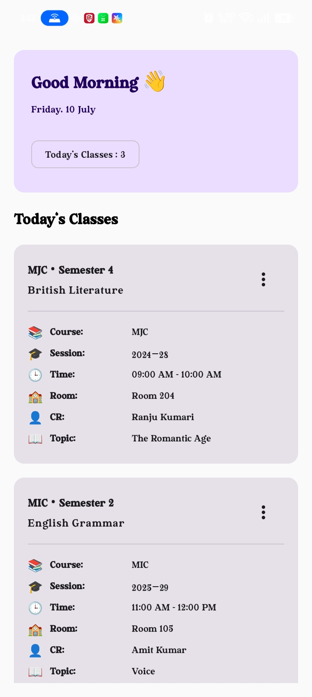
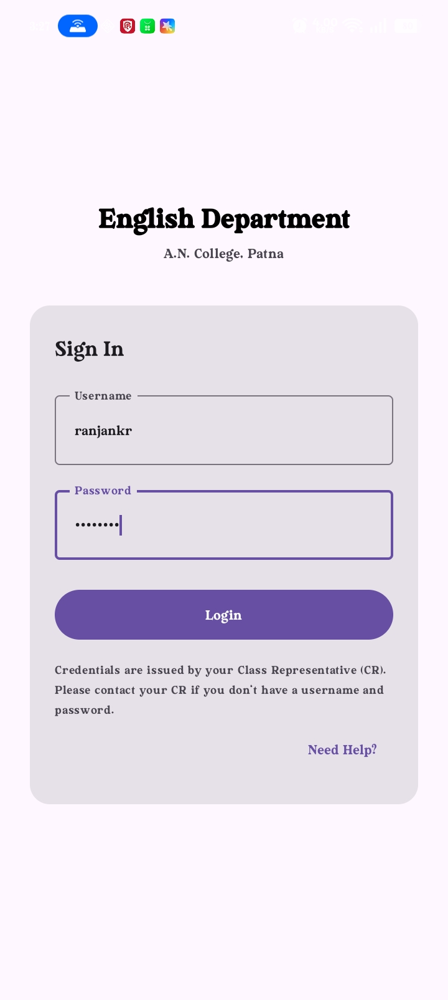
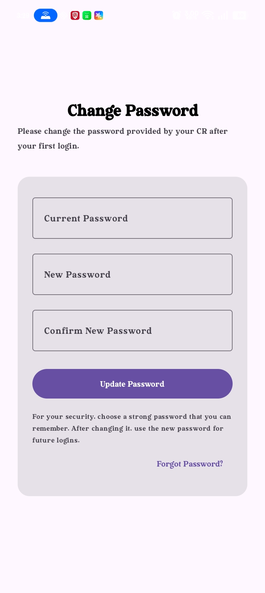

# App Screenshots

This document provides a visual overview of the application's primary user interfaces.

## Teacher Home Screen



**Purpose**

The main dashboard for teachers after signing in.

### Highlights

- Personalized greeting
- Today's class summary
- Class cards with subject, semester, session, CR, and topic
- Overflow menu for class actions

## Login Screen



**Purpose**

The authentication screen where users sign in using credentials issued by their Class Representative (CR).

## Change Password Screen



**Purpose**

Allows users to replace the temporary password issued during account creation.

---

# Updating Screenshots

1. Save the screenshot in the `screenshots/` folder.
2. Use a descriptive lowercase filename.
3. Add a new section:

```md
## Screen Name


**Purpose**

Brief description of the screen.
```

4. Commit both the Markdown file and the image.

---

# Notes

- Keep screenshots up to date after UI changes.
- Use consistent image dimensions.
- Avoid including sensitive or personal information.