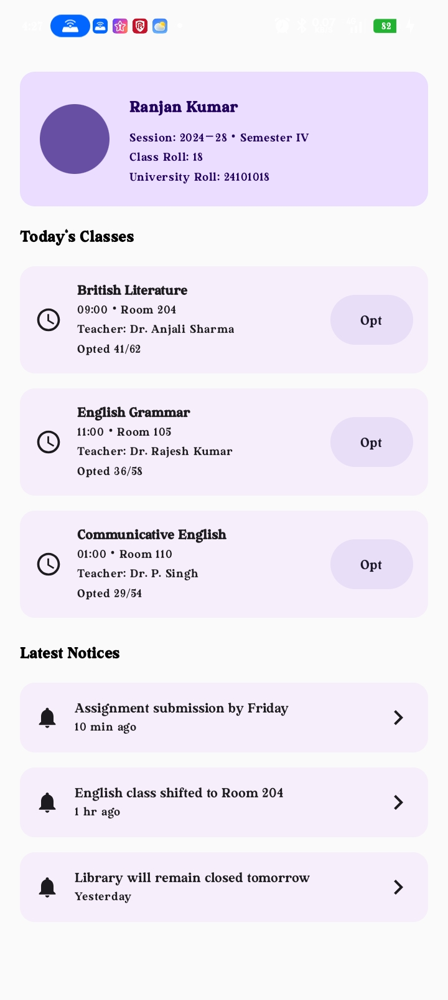

# App Screenshots

This document provides a visual overview of the application's primary user interfaces.

## Teacher Home Screen

**Purpose**

The main dashboard for teachers after signing in.

### Highlights

- Personalized greeting
- Today's class summary
- Class cards with subject, semester, session, CR, and topic
- Overflow menu for class actions

## Login Screen

**Purpose**

The authentication screen where users sign in using credentials issued by their Class Representative (CR).

## Change Password Screen

**Purpose**

Allows users to replace the temporary password issued during account creation.

---

## Students Home Screen

**Purpose**

Allows students to see today classes,opt,withdraw,notices,room no,topic teacher name etc.

---
